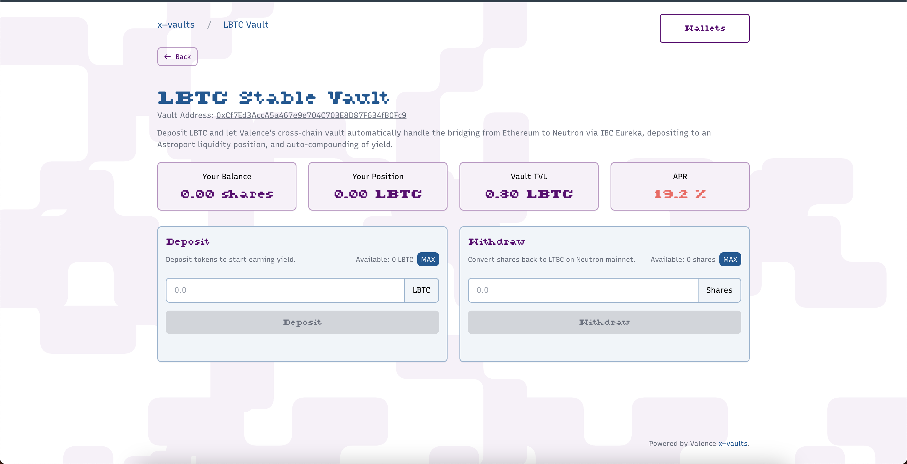

# Neutron X-Vault Demo



A simple web application for interacting with ERC-4626 vault contracts on Ethereum mainnet in order to integrate with Valence cross-chain vaults. Built with Next.js, Tailwind CSS, and wagmi. Nix reproducible environment and Foundry/Anvil for local Ethereum development.

## Set up local environment

You will need an EVM endpoint with a deployed vault contract. For now, easiest way to deploy the vault used here is with the `valence-protocol` repository.

1. Prerequisities
   Install rust, docker, [foundry](https://github.com/foundry-rs/foundry)

2. Clone the deployment script

```bash
git clone https://github.com/timewave-computer/valence-protocol
```

3. Compile solidity contracts
   We only are interested in `OneWayVault.sol`, but the repo is set up in a way where everything will compile for the time being

```bash
cd valence-protocol/solidity
forge soldeer install && forge build
```

4. Compile & run the deploy script
   Same as above, this is couple to the rest of the repo for the time being, so there will be alot to compile. It will take a few minutes.
   This script starts an anvil instance, and deploys `OneWayVault.sol` and a mock ERC20

```bash
## from valence-protocol/ (cd ..)
cargo run --package valence-e2e --example one_way_vault
```

5. Get environment variables
   Once the script finished, you should have

- rpc endpoint running on `http://localhost:8545`
- vault address
- erc20 address

6. Fund EVM address

```bash
# sets your account balance to 10000 ETH
cast rpc anvil_setBalance <EVM_ADDRESS> 0x56BC75E2D63100000 \
--rpc-url "http://localhost:8545"

# set ERC20 balance
# the private key is derived from the neumonic commited in the deploy script
cast send \
--rpc-url "http://localhost:8545" \
--private-key "0xac0974bec39a17e36ba4a6b4d238ff944bacb478cbed5efcae784d7bf4f2ff80" \
<ERC20_ADDRESS> \
"mint(address,uint256)(address,uint256)" \
<EVM_ADDRESS> \
100000000000
```

## Start UI

1. Set up environment variables
   Verify anvil endpoint

```bash
cp .env.example .env
```

2. Customize configuration files.

- `vaults.config.json`: add the vault address and ERC20 address. More docs on this file below
- `wagmi.config.ts`: specifies which EVM chains + RPCs are used when connecting a wallet
- `graz.config.ts`: specifies which cosmos chains + RPCs are used when connecting a wallet

3. start server

```bash
npm install
npm run start
```

4. Add testnet to your browser wallet as a custom network:
   - Network Name: Vaults Test Env (or any name)
   - RPC URL: http://localhost:8545 (or any anvil rpc)
   - Chain ID: 31337
   - Currency Symbol: ETH

````

## Linting
Linting should run on commit, but you can also run the below:
```bash
git add .
npm exec lint-staged
````

## About `vaults.config.json`

The `vaults.config.json` file contains an array of vault configurations. Each vault object has the following fields:

- `vaultId`: A unique identifier for the vault used internally by the application
- `symbol`: The symbol of the token accepted by the vault (e.g., "USDC", "ETH")

### EVM Configuration

- `evm`: Configuration for the Ethereum side of the vault
  - `chainId`: The ID of the blockchain network where the vault is deployed (e.g., 1 for Ethereum mainnet)
  - `vaultAddress`: The Ethereum proxy address of the vault contract
  - `tokenAddress`: The address of the ERC-20 token that the vault accepts as deposits
  - `transactionConfirmationTimeout`: Maximum time (in milliseconds) to wait for transaction confirmations
  - `startBlock`: The block number from which to start scanning for vault events
  - `explorerUrl`: URL for the blockchain explorer (e.g., "https://etherscan.io")

### Cosmos Configuration

- `cosmos`: Configuration for the Cosmos side of the vault
  - `chainId`: The ID of the Cosmos chain (e.g., "neutron-1")
  - `explorerUrl`: URL for the Cosmos chain explorer
  - `token`: Token configuration
    - `denom`: The denomination of the token on the Cosmos chain
    - `decimals`: Number of decimal places for the token
  - `startBlock`: The block number from which to start scanning for vault events

### UI Copy Configuration

- `copy`: Text content for the UI
  - `name`: Human-readable name of the vault
  - `description`: A brief description of the vault's purpose
  - `deposit`: Deposit-related text
    - `title`: Title for the deposit section
    - `description`: Description of the deposit process
    - `cta`: Call-to-action text for deposit button
  - `depositInProgress`: Text for deposit in progress state
    - `title`: Title for the progress section
    - `steps`: Array of step descriptions
    - `description`: Description of the ongoing process
  - `withdraw`: Withdrawal-related text
    - `title`: Title for the withdrawal section
    - `description`: Description of the withdrawal process
    - `cta`: Call-to-action text for withdrawal button
  - `withdrawInProgress`: Text for withdrawal in progress state
    - `title`: Title for the progress section
    - `steps`: Array of step descriptions
    - `description`: Description of the ongoing process
  - `withdrawCompleted`: Text for completed withdrawal state
    - `title`: Title for the completion section
    - `description`: Description of the completed process

### APR Configuration

- `aprRequest`: Configuration for fetching the vault's APR (Annual Percentage Rate)
  - `type`: The source type for APR data ("api" or "contract")
  - For API requests:
    - `url`: The endpoint URL
    - `method`: HTTP method (GET, POST, etc.)
    - `headers`: Optional HTTP headers
    - `body`: Optional request body
  - For contract requests:
    - `address`: The contract address
    - `abi`: Contract ABI array
    - `functionName`: Name of the function to call
    - `args`: Optional arguments for the function call

```

```
